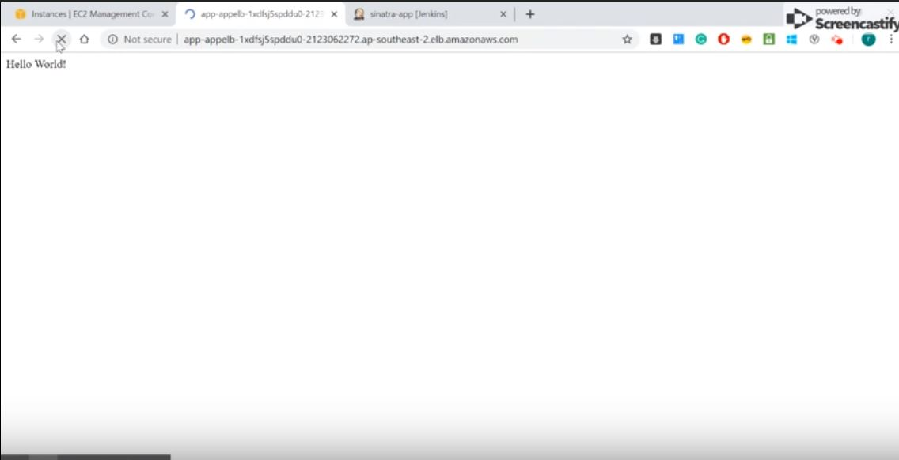
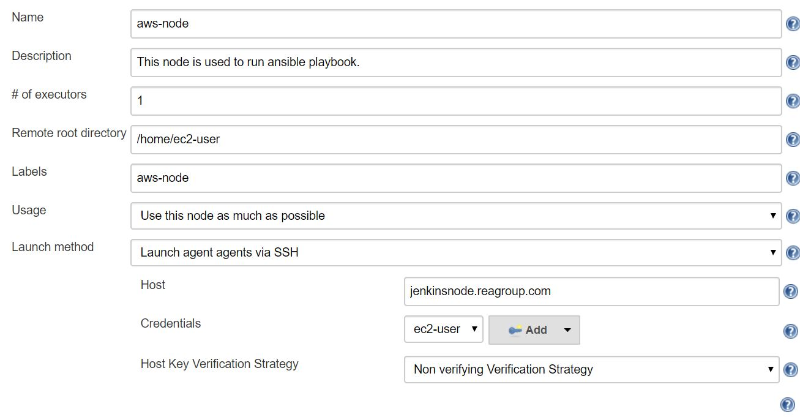
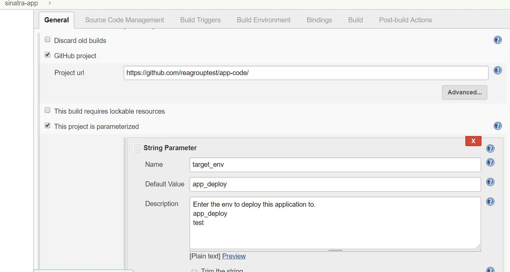
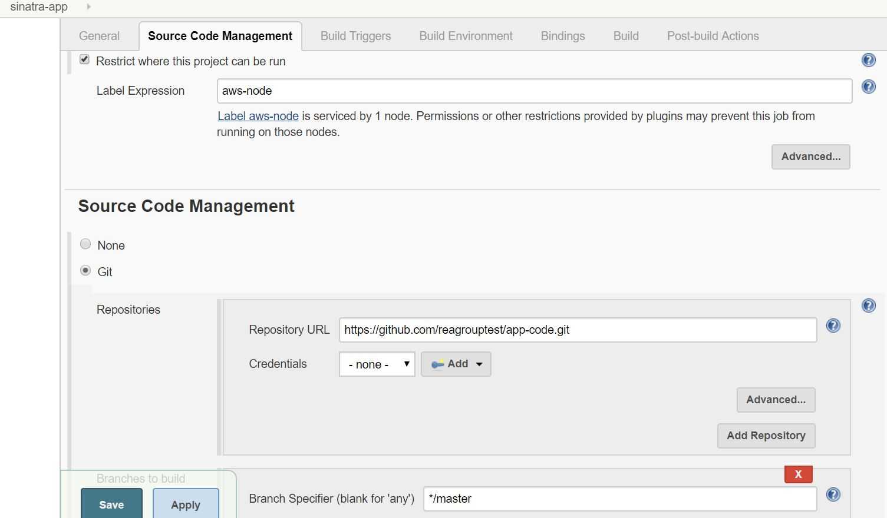
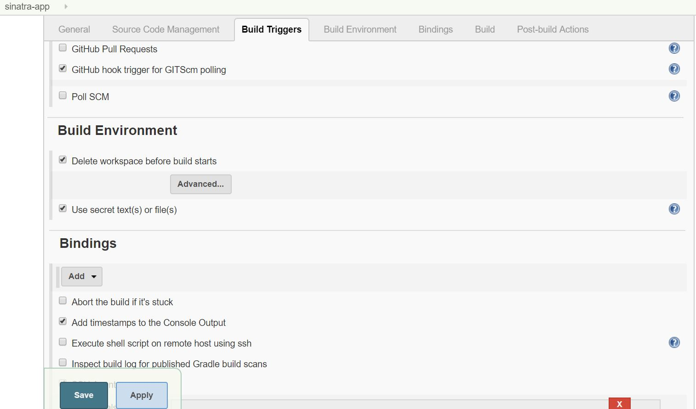
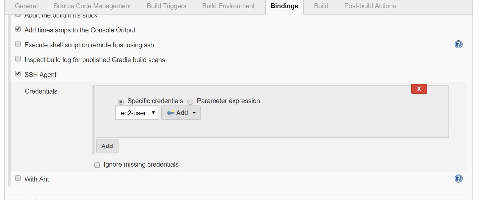
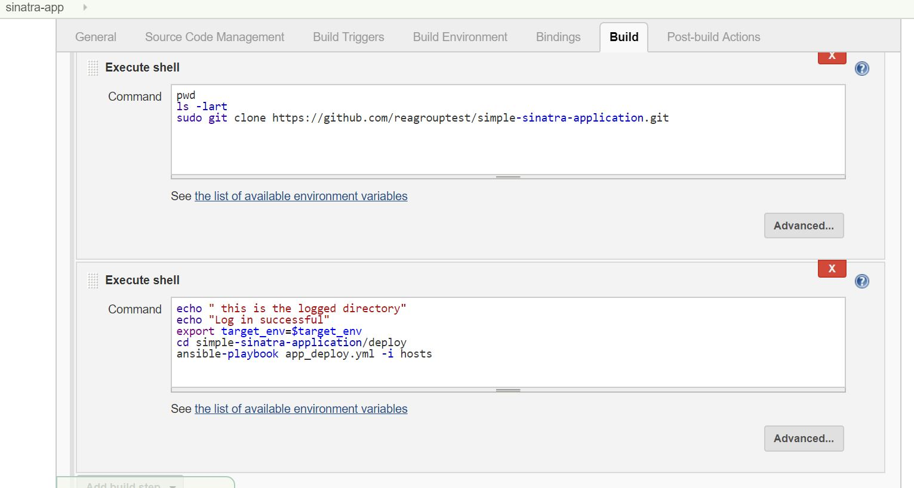
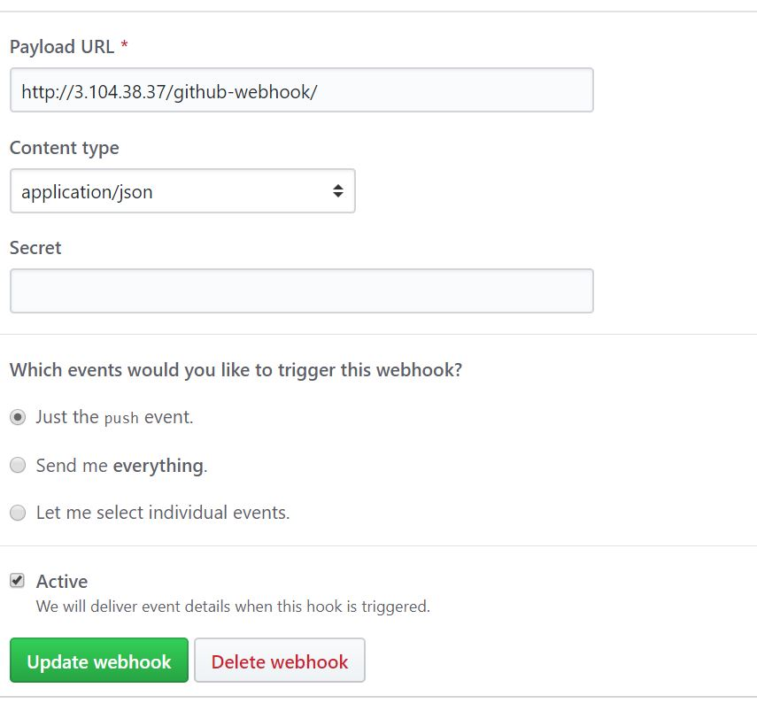

# sinatra-app
This project is used to host sinatra app in AWS. 

# Purpose
The aim of this repository is to house sinatra application to server on port 80. It is a internet facing application which has been designed for high availability using AWS resources.

This project has been designed such that it does not require system engineer support for application change deployment. Whenever a developer pushes the code to application repository, jenkins automatically build the server and your load balancer serves the updated output.

## Watch the application deployment:

The deployment starts just with the Github push in the application code.


[](https://drive.google.com/file/d/1qgdAEfIBvgLOu5dxWaGbqESkAdsD1D62/view)


# Assignment specific links
* [Asked assignment Question](https://github.com/rea-cruitment/simple-sinatra-app.git)
* [Application code repository](https://github.com/reagrouptest/app-code.git)
* [Infrastructure as code ](https://github.com/reagrouptest/simple-sinatra-application.git)


 
# Instruction to run the project.

## Prerequisite.
* User should have AWS account.
* User with root level privileges.
* Tools installed on local machine- git bash, source tree, visual studio code.


## Assumptions

Assumption is made that the application is used only for development purpose. Production application should be built on HTTPS and communications between host should be secure. 

There are few known practices which can be implemented to make it more secure and highly available. 
There should not be single point of failure.

* This architecture should be used only for development purpose as it serves HTTP request.
  Recommendation is to use HTTPS for security reason.
* The application is designed in single region - Australia.
* The request is served on HTTP port using load balancer.
* Root user is used only for test purpose. It is advised not to use root user.
* AWS infrastructure has public subnet. You should not deploy your application in public subnet.
* Please do not store your private key on AWS server. 
* Master branch is used for application deployment.
* Jenkins server is designed on single host. It is recommended to create the jenkins 
  using high availability design.
* Always ensure traffic in flight and data at rest is encrypted in cloud.


## Steps for AWS environment creation.

Please download the  [Infrastructure as code ](https://github.com/reagrouptest/simple-sinatra-application.git) github repo and follow below instruction. This repository has vpc.yml and ec2.yml files which will be used for AWS network and application infrastructure build.

1. Create network in AWS.
2. Create application infrastructure in AWS.

### Create AWS network:

1. Login to AWS console.
 [aws login](https://aws.amazon.com/console/)
2. Look for AWS service- cloud formation. Go to the service and select 'create stack'. To create stack you can upload the file to S3 or use your local machine to upload the file. In this case you can use your local machine to 'upload a template file' called vpc.yml which was downloaded from git repository. This will build your network in AWS. Follow below:

Process flow-
AWS service-->cloudformation-->create stack-->upload a template file-->choose file-->stack name

3. Wait for the cloud formation to create the stack of your network. The status should change to 'Create_complete'. Once the status changes to completed. Your network is ready to build your first ec2 instance.


### Create application infrastructure in AWS.

1. Go to AWS service ec2 and create your key pairs with the name 'sinatra-key'. Once you have created the key-pair it will be downloaded to your local which you can use to login to the application server.

Process flow-
AWS service-->ec2-->key pairs-->create key pair.
2. Create KMS key to encrypt the ec2 volume by following below process.

Process flow-
AWS service-->customer managed keys-->create alias(sinatrakmskey)-->key administrators(cloudformationrole)-->key usage permission(cloudformationrole)-->finish

Once the kms key is completed. You will need to update the ec2.yml code block with kms key arn.

```
 ##Provide your kmskeyId here
      KmsKeyId: arn:aws:kms:ap-southeast-2:929562907700:key/3b6448a4-3ec7-4bac-8ef5-57d79b3d82de
```      
3. Create application stack including all resources using ec2.yml file.
Process-

AWS service-->cloudformation-->create stack-->upload a template file(ec2.yml)-->choose file-->stack name-->mark tick to acknowledge IAM creation


## Application and CI-CD environment provisioning.

Steps:

1. You will need to login to the public linux box created by ec2.yml cloud formation.
   To login- Open your git bash and login to the public server using the public ip.(You can get the public IP from AWS ec2 instance service)

   ```
   ssh ec2-user@ip -i sinatra_key.pem 
   ```
   where ip=your public linux server ip and sinatra_key is the key created through aws console previously.

 2. Append your sinatra_key.pem to authorized_keys of ec2-user. This is not recommended in production servers.
    ```
     cd  /home/ec2-user/.ssh
     vi authorized_keys
    ```

   
 3. Install python, ansible,java and jenkins master on your current public linux instance.

  ```
  sudo yum update -y
  sudo yum -y install java
  sudo yum -y install python-pip
  sudo pip install ansible
  sudo wget -O /etc/yum.repos.d/jenkins.repo http://pkg.jenkins.io/redhat/jenkins.repo
  sudo rpm --import https://pkg.jenkins.io/redhat/jenkins.io.key
  sudo yum install jenkins -y
  sudo service jenkins start


  ```

   Update the Ip tables to allow jenkins master to listen on port 80.

   ```
   sudo iptables -I INPUT 1 -p tcp --dport 8443 -j ACCEPT
   sudo iptables -I INPUT 1 -p tcp --dport 8080 -j ACCEPT
   sudo iptables -I INPUT 1 -p tcp --dport 443 -j ACCEPT
   sudo iptables -I INPUT 1 -p tcp --dport 80 -j ACCEPT

   
   sudo iptables -A PREROUTING -t nat -i eth0 -p tcp --dport 80 -j REDIRECT --to-port 8080
   sudo iptables -A PREROUTING -t nat -i eth0 -p tcp --dport 443 -j REDIRECT --to-port 8443
   sudo su -
   sudo iptables-save > /etc/sysconfig/iptables
   
   ```

   For the first time when you use the dashboard at http://'public linxu ip':80, you will be prompted to unlock Jenkins. You can get the password from the path- /var/lib/jenkins/secrets/initialAdminPassword to unlock jenkins.

   The installation script directs you to the Customize Jenkins page. Go to Manage Jenkins--> Manage plugins --> Available--> install and select plugins- ssh, github, ssh agent, github integration and then restart the jenkins.

   Create your first admin jenkins user.
   
   ##### Configure jenkins node:

   SSH to 'Private-jenkinsnode' from your current public Linux box and install dependencies for node to work with master.

   ```
   ssh ec2-user@jenkinsnode.reagroup.com -i /home/ec2-user/.ssh/authorized_keys
   sudo yum -y install java
   sudo yum -y install python-pip
   sudo pip install ansible
   sudo yum -y install git
   
   ```

   Update the authorized_keys file with the content of sinatra-key.pem  for ansible to interact with sinatra web servers.

   ```
   cd /home/ec2-user/.ssh
   vi authorized_keys

   ```

   Login to jenkins master using - http://'public ip address of linux host' and configure node as below-

   

    set Remote home directory=/home/ec2-user
        Launch method = Launch agent agents via SSH.
        Host= jenkinsnode.reagroup.com
        Credentials = ' update your sinatra_key.pem file content to jenkins credentials manager with the username ec2-user.'
        Connecton timeout in seconds= 60
        Remote work directory=/home/ec2-user


   ##### Configure sinatra-app job

   Go to Jenkins dashboard-->New item--->enter item name('sinatra-app), select 'freestyle project'-->
   configure the job as below-
    
   

   

   

   

   

 
   ```
    pwd
    ls -lart
    sudo git clone https://github.com/reagrouptest/simple-sinatra-application.git

    echo " this is the logged directory"
    echo "Log in successful"
    export target_env=$target_env
    cd simple-sinatra-application/deploy
    ansible-playbook app_deploy.yml -i hosts


   ```


  4. Update Github to allow scm polling.

     Go to the [Git hub](https://github.com/reagrouptest/app-code/settings/hooks/127074657)
     -->Settings-->Webhooks--> add webhook 
     Update the settings as below-

     


    You will be not able to perform above step unless you have github access. This step is for information only.


  5. Push the changes to the [Application code repository](https://github.com/reagrouptest/app-code.git)

    
    This will trigger the automated job build via jenkins.


    Your application is ready to serve customer.

    Happy coding!


# Design decision.

## For infrastructure built in AWS.

The application uses custom VPC instead of using default VPC. This helps to control your network security in more efficient way. 

### VPC

VPC is most important component of cloud based infrastructure and it is important to get it right from the first. VPC design has far-reaching implications for scaling, fault-tolerance and security. It is responsible for infrastructure flexibility and will save your important time to free up address space. It is important to lay out VPC in correct way than the careless way. VPC for this project is set up in AWS Sydney region.

### Subnet


 Subnet layout is the key to a well-functioning VPC. Subnets determine routing, Availability Zone distribution and Network Access Control Lists. VPC is not a data center, data center network or switches. A VPC is a software defined network optimized for moving massive amount of packets into, out of and across AWS region.

 Below are few reason of creating different subnets:
* You need different hosts to route in different ways- Internal only, public-facing.
* You need to distribute workloads across different multiple AZ to achieve fault-tolerance.
* Security requirements for NACL and route table to serve specific ports and subnets.

In this project 2 subnets in each AZ are created to server traffic.


### Routing


It is important to apply the principle of proper and secure routing when you are exposing your servers to internet. Route tables helps to route traffic from Internet to the VPC.
The project uses 2 route tables - Public and Private. Public route table is associated with Public subnet and private route table is associated with Private subnet. 

### Fault-Tolerance


AWS provides geographic distribution out of the box in the form of Availability Zones (AZs). Every region has at least two.

Subnets cannot span multiple AZs. So to achieve fault tolerance, you need to divide your address space among the AZs evenly and create subnets in each. The more AZs, the better. if you have three AZs available, split your address space into different parts. 
The reason you need to divide your address space evenly is so the layout of each AZ is the same as others. This will help resources like autoscaling groups to be evenly distributed. If you create disjointed address blocks, it will require lot of maintenance.

In this project we have divided our subnet into similar block . The division is based on block not on number of IPs.


### Security


The first layer of defense in a VPC is the routing layer.

Above the routing layer are two levels of complementary controls: Security Groups and NACLs. Security Groups are dynamic, stateful and capable of spanning the entire VPC. NACLs are stateless (meaning you need to define inbound and outbound ports), static and subnet-specific.

Generally, you only need both if you want to distribute change control authority over multiple groups of admins. For instance, you might want your sys admin team to control the security groups and your networking team to control the NACL’s. That way, no one party can single-handedly defeat your network restrictions.

In practice, NACLs should be used sparingly and, once created, left alone. Given that they’re subnet-specific and punched down by IP addresses, the complexity of trying to manage traffic at this layer increases geometrically with each additional rule.

Security Groups are where the majority of work gets done. Unless you have a specific use-case like the ones described earlier, you’ll be better served by keeping your security as simple and straightforward as possible. That’s what Security Groups do best.

The VPC for this project is  subdivided into different blocks as below -

```
10.0.0.0/16:
AZ A
    10.0.0.0/19 — Private
            10.0.32.0/20 — Public
AZ B
    10.0.64.0/19 — Private
            10.0.96.0/20 — Public
                    
AZ C
   10.0.128.0/19 — Private
            10.0.160.0/20 — Public

     
```


# Design decision for application.

The application is designed in three availability zone with three servers to provide high availability in Australia region. The traffic is served using load balancer which listens on port 80.

The application uses route53 entry as hostname in ansible playbook. This setup requires less maintenance whenever the IP address of instance changes.

Jenkins automatically deploy application code whenever there is update to Github application code repository.

### Why ansible?
1. Low overhead- due to agentless model, Ansible reduces the overheads on the network by preventing the nodes from polling the controlling machine.
2. Secure and consistent- Ansible only uses SSH and Python on the managed nodes. This ensures safety and security. Also, Ansible ensures consistent environments.
3. Reliable- an Ansible playbook can be idempotent when written carefully. This prevents unexpected side-effects on the managed systems.
4. Good performance- Ansible delivers flawless performance. It is a powerful tool for deploying software applications using SSH.


# References

* [AWS whitepapers.](https://aws.amazon.com/whitepapers/)
* [AWS best practices.](https://aws.amazon.com/whitepapers/architecting-for-the-aws-cloud-best-practices/)
